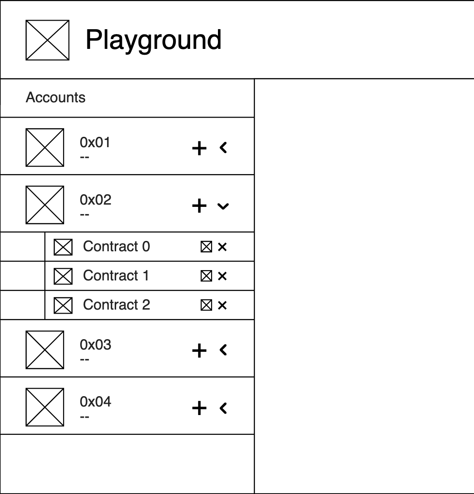
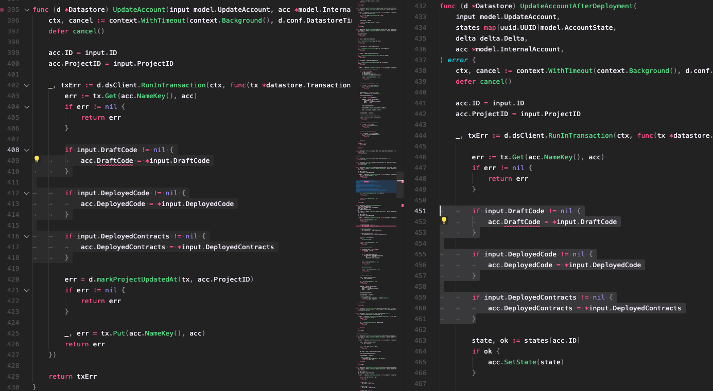
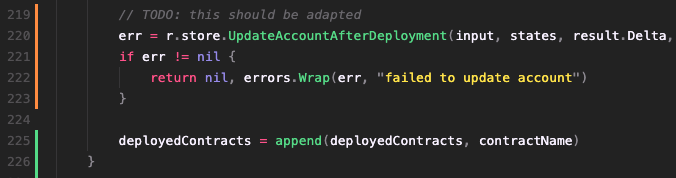

# Playground Feature: Multiple contracts per account - Milestone 1

## Frontend

We figured that the best way to show the relations between account and contract was a tree view. This is the design mockup for our idea:

We thought that the arrows kind of disturbed the nice linear design of the icons, so here is an alternative design:

This is an example implementation:

Looking forward to seeing your thoughts on this UI.

## Backend

Rough description of changes:

- Model changes
    
    We propose that we encapsulate all contract related fields (`DraftCode`, `DeployedCode`and `Name`) into new `Contract` struct.
    
    - remove contract related fields from `InternalAccount` and `Account` and transfer them to `Contract` struct
        - `InternalAccount.DraftCode` ⇒ `Contract.DraftCode`
        - `InternalAccount.DeployedCode` ⇒ `Contract.DeployedCode`
        - remove `InternalAccount.DeployedContracts[]`, because deployment status can be acquired by checking if `Contract.DeployedCode` is empty or not ? (check [this question]())
- Changes to functionality
    - adapt `UpdateAccount` to support the new datatype and functionality
    - TODO: add more description

### Questions

- Why is the update logic duplicated for `DraftCode`, `DeployedCode` and `DeployedContracts` fields in `UpdateAccount` and `UpdateAccountAfterDeployment` ?
    
    
    
    Was this intended to be duplicated or is it waiting for refactoring (based on the TODO bellow) ?
    
    
    
- Why is `InternalAccount.DeployedContracts` an array already ? Is this just for future use (multiple contracts per account feature) or does it have some other use cases that we missed ?
    
    Because if the backend supported only a single contract per account, it would make more sense for `DeployedContracts` to be a single String, right ?
