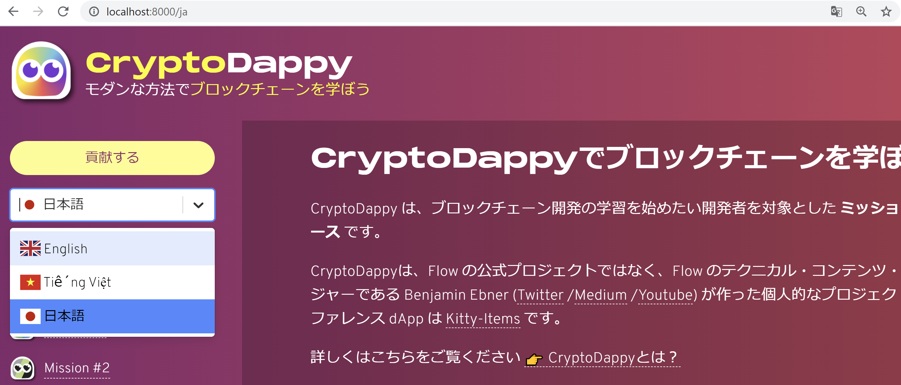

## CryptoDappy Feature: localization (I18n) solution - Milestone 1

## Description

This PR is for issue #6.

- Provide a summary of the work completed in this PR.
 - List of requirements that are being submitted.

## Submission Links & Documents

- Include all links to PRs on other repositories (if required) and be clear as to what it does. Ensure you follow the PR guidelines on the other repositories.
  - Include or highlight any new updates made from a previous submission or milestone.

### Milestone Requirements

> I18n solution & add language-selection dropdown in navbar

#### Language-selection dropdown in navbar

Add a select menu to the navbar using `react-select` and `react-country-flag` libraries.

Screenshot:


#### I18n solution

Based on the official Gatsby i18n sample, we have implemented a page-by-page translation function using mdx files and a sentence-by-sentence translation function using lang.json files.

##### Using mdx based i18n

Prepare a translation file in the form of `pagename.lang.mdx` under the `src/missions folder`.

##### Using  json based i18n

Prepare a translation file in the form of `lang.json` under the folder `src/config/translations`.

eg.)

ja.json
```
{
    "subtitle": "モダンな方法で<Highlight>ブロックチェーンを学ぼう</Highlight>",
    "beta": "ベータ版",
    "feedback": "フィードバック",
    "contribute": "貢献する",
    "index_title": "CryptoDappyでブロックチェーンを学ぼう",
    ...
}
```

To use the translated text in the page, use the `useTranslations` component.

index.js
```
import * as React from "react"
import useTranslations from "../components/useTranslations"

const IndexPage = () => {
  const { index_title } = useTranslations

  return (
    ...
    <h1>{index_title}</h1>
    ...
  )
}
```

##### Localized Link & Navigate

Links in the site will be converted into pages according to the current selected language using the `LocalizedLink` and `LocalizedNavigate` components.

navbar.js
```
<NavLink>
  <Dappy src={`${config.ASSETS_URL}/images/Dappy${i + 1}.png`} />
  <LocalizedLink to={m.link}>{m.name}</LocalizedLink >
</NavLink>
```

```
<Button onClick={() => LocalizedNavigate('/contribute', lang)}>Contribute</Button>
```

##### Edit i18n options

To add or change a language setting, edit `config/i18n.js`.

```
module.exports = {
  defaultLang: 'en',
  langs:{
    en: {
      path: `en`,
      name: 'English',
      countryCode: 'GB',
    },
    vn: {
      path: `vn`,
      name: 'Tiếng Việt',
      countryCode: 'VN',
    },
    ja: {
      path: `ja`,
      name: '日本語',
      countryCode: 'JP',
    },
  }
}
```

### Software Requirements

> Testing

### Other Requirements

> Documentation of the steps taken

## Additional works

In addition to the official Gatsby sample, we have implemented the following additional features.

### Japanese translation

Our team has created additional Japanese translation files for these.

- contribute.ja.mdx
- FAQ.ja.mdx
- mission-[1-6].ja.mdx
- onboarding.ja.mdx
- overview.ja.mdx
- resources.ja.mdx
- ja.json

### Json ranslation with HTML tag/React component

Our team has implemented an additional function that allows you to use html tags and React components in the translated text in lang.json.

eg.)

en.json
```
{
    ...
    "subtitle": "The modern way to <Highlight>learn blockchain</Highlight>",
    ...
    "index_p1": "CryptoDappy is a <strong>mission-based online course</strong> directed at developers who want to get started learning blockchain development.",
}
```

index.js
```
import useTranslations from "../components/useTranslations"
import parse from 'html-react-parser';

const IndexPage = () => {
  const {index_p1} = useTranslations()
  ...
  return (
    ...
    <p>{parse(index_p1)}</p>
    ...
  )
}
```

header.js
```
import useTranslations from "./useTranslations"
import parse, { domToReact } from 'html-react-parser';

export default function Header() {
  const { subtitle } = useTranslations()
  const replace = (node) => {
    if(node.type ==="tag" && node.name === "highlight"){ return <Highlight>{ domToReact(node.children) }</Highlight> }
  }

  return (
    ...
    <SubTitle>{parse(subtitle, { replace })}</SubTitle>
    ...
  )
}

const Highlight = styled.span`
  color: yellow;
  word-break: break-all;
`
```

### Translation fallback

Our team has added the ability to fall back to the default language (en) if there is no corresponding translation in the mdx file or lang.json for each language.

#### Mdx fallback example

In case of privacy.en.mdx and imprint.en.mdx do not exist.

```
src
└── missions
    ├── mission-1.ja.mdx
    ├── mission-1.mdx
...
    ├── privacy.mdx
    └── imprint.mdx
```

Mapping of URL paths to mdx files

- https://www.cryptodappy.com/missions/mission-1 -> mission-1.mdx
- https://www.cryptodappy.com/ja/missions/mission-1 -> mission-1.ja.mdx
- https://www.cryptodappy.com/privacy -> privacy.mdx
- https://www.cryptodappy.com/ja/privacy -> privacy.mdx
- https://www.cryptodappy.com/imprint -> imprint.mdx
- https://www.cryptodappy.com/ja/imprint -> imprint.mdx

#### Json fallback example

In case of the {title} key is present in en.json but not in ja.json.

en.json
```
{
    "title": "<Highlight>Crypto</Highlight>Dappy",
    "subtitle": "The modern way to <Highlight>learn blockchain</Highlight>",
    ...
}
```

ja.json
```
{
    "subtitle": "モダンな方法で<Highlight>ブロックチェーンを学ぼう</Highlight>",
    ...
}
```

The value of the {title} key always refers to the value of title in en.json.

## Requirements Check

- Have have you met the milestone requirements? Yes
- Have you included tests (if applicable)? Testing manually
- Have you met the contribution guidelines of the repos you have submitted code to (if applicable)? Yes
- If this is the last milestone:
  - Demonstrate that you've met all the acceptance criteria (link to code, demos, instructions to run etc.)
  - Demonstrate that you've met all milestone requirements and highlight any extensions or additional work done.
  - Include a payout structure by percentage for each team member (ie. Bob: 20%, Alice: 80%). Yes

### Payout structure

- @knagato: 33.33%
- @avcdsld: 33.33%
- @wshino: 33.33%

## Other Details

- Is there anything specific you'd like the PoC to know or review for?
- Are there other references, documentation, or relevant artificats to mention for this PR (ie. external links to justify design decisions, etc.)?

- [Official Gatsby i18n example](https://github.com/gatsbyjs/gatsby/tree/master/examples/using-i18n)
- [Gatsby doc: Localization and Internationalization](https://www.gatsbyjs.com/docs/how-to/adding-common-features/localization-i18n/)
- [CryptoDappy issue: Content Translations](https://github.com/bebner/crypto-dappy-learning-hub/issues/2)
- [CryptoDappy PR: Vietnamese translations](https://github.com/bebner/crypto-dappy-learning-hub/pull/4)
